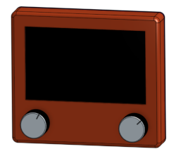

# etch-rs
A digital etch-a-sketch, programmed in Rust

## Parts
View the enclosure CAD model on [OnShape](https://cad.onshape.com/documents/e690354f5c07f20bde7623b1/w/a182bf3fbff4dd99a6671f5c/e/9b6cb06694b79f0122820339?renderMode=0&uiState=66b0045b4d7bf54af7cd6bd1)

| Part | Product Name | QTY |
| ---- | ------------ | --- |
| CPU | [Raspberry Pi Pico](https://www.raspberrypi.com/products/raspberry-pi-pico/) | 1 |
| LCD Driver | [RA8875 Driver Board](https://www.adafruit.com/product/1590) | 1 |
| Screen | [5.0" 40-pin 800x480 TFT Display](https://www.adafruit.com/product/1680) | 1 |
| Encoder | [Rotary Encoder - Illuminated (RGB)](https://www.sparkfun.com/products/15141) | 2 |
| Knob | [Silver Metal Knob - 14x24mm](https://www.sparkfun.com/products/10001) | 2 |
| IMU | [SparkFun IMU Breakout - MPU-9250](https://www.sparkfun.com/products/retired/13762) | 1 |
| Battery | E-flite EFLB0990 7.4V 2S LiPoly Battery | 1 |
| Toggle Switch | Any | 1 |

## To Do list
- Software
    - Accelerometer code
    - Fine tune cursor speed
    - Organization and cleanup
    - Use PIO for encoders
- Electrical
    - Create schematic
    - Handle battery input
    - Final wiring
    - Custom PCB
- Hardware
    - Mounting features for wires and electronics
